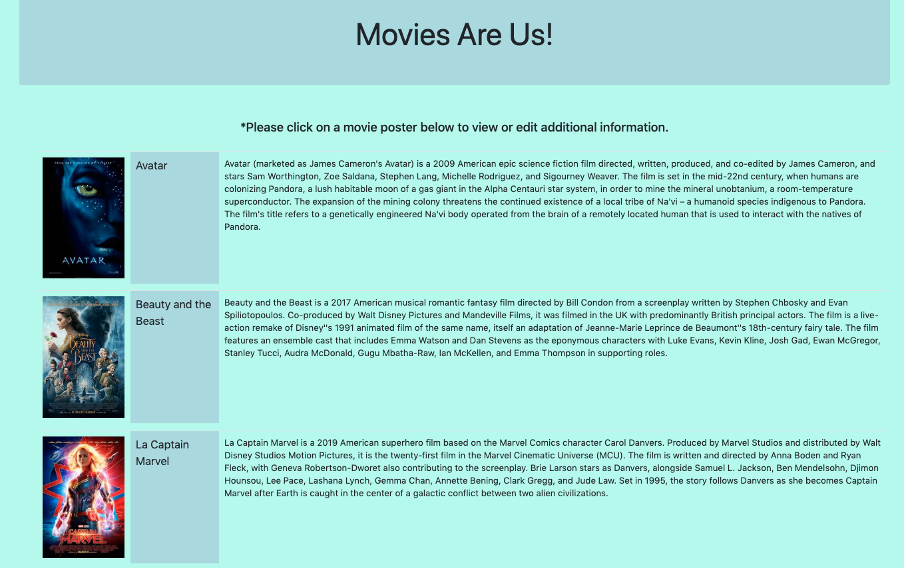
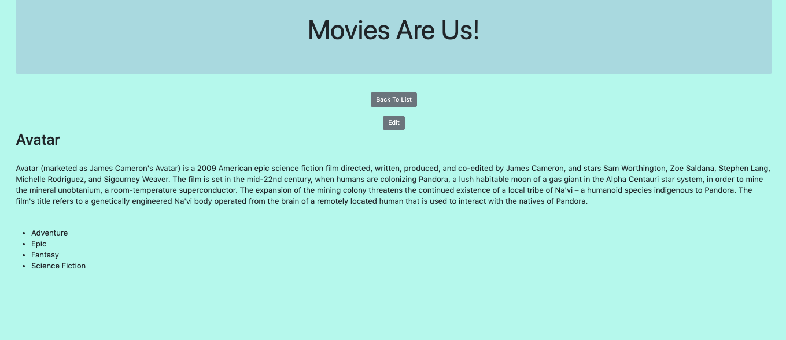
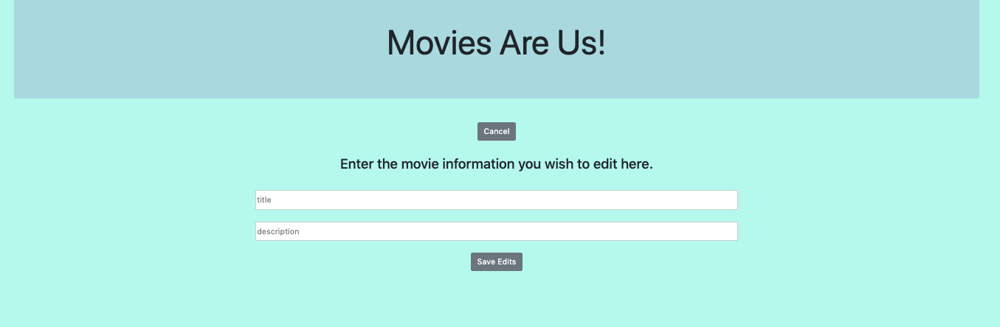

# Movies Are Us
Movies Are Us is a full-stack application that displays a list of current movies available with an image and description. Users are able to click an individual movie to view the individual movie information. Users are able to edit the movie name and description and toggle between all 3 views. 

### Technologies
YouTube API, JavaScript, React, Node.js, PostgreSQL, SQL, Express, React-Redux, Redux-Sagas

### Getting Started
These instructions will get you a copy of the project up and running on your local machine.

### Prerequisites
Before you get started, make sure you have the following software installed on your computer:

- [Node.js](https://nodejs.org/en/)
- [PostrgeSQL](https://www.postgresql.org/)
- [Nodemon](https://nodemon.io/)

### Download this project.
- npm install
- Open the database.sql file in the repo. Create a movies and genres table in Postico.
- Make sure the database is connected
- npm start server
- npm run client

### Movies Available View

### Individual Movie View

### Edit View

